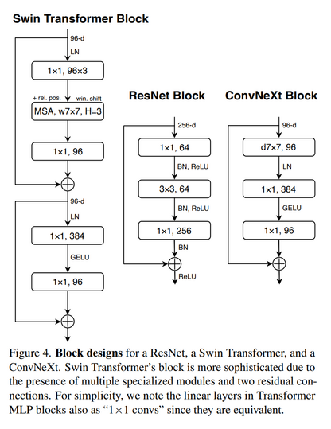
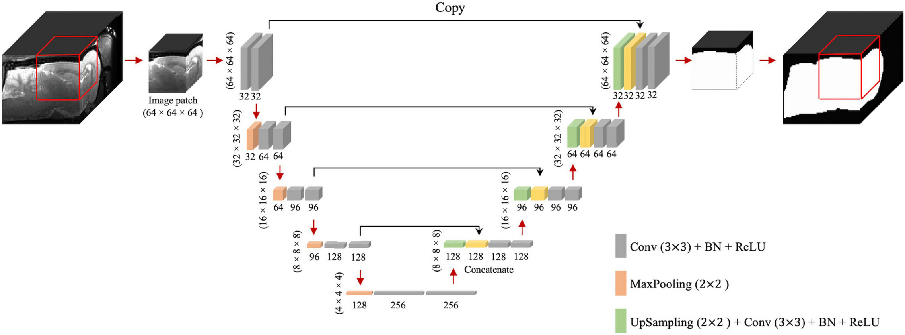

# Ashen Venus

Venus was the patron saint of Pompeii, the city covered in Ash.

This repo is an entry to the [Vesuvius Challenge or Scroll Prize](https://scrollprize.org/)

## Setup

```
conda create -n ashenvenus python=3.7
pip install -r requirements.txt
```

OR

```
conda env create --file environment.yaml
```

## Stream 2: Designing the model

Inspirations

### ConvNext


- GeLU is better than ReLU
- Residual connections
- Layer Norm
- 7x7 kernels followed by 1x1 kernels

### UNet


- Bx64x64x64x32
- Max pools before reducing dimmension
- Batch Norms into ReLU

### Our problem

Input is a 3D volume of
- Small Bx65x1x1
- Large Bx65x1028x256

Output is single number representing ink or no ink
- Bx1
- Binary classification
- activation function is sigmoid

Memory is available in our compute?

- Local training 2x8GB (2xNVIDIA GeForce GTX 1080 Ti)
- Notebook training 2x16GB (2xNVIDIA T4)

### Prompts

Can you design a PyTorch model for me in Python. I want a Convolutional network with the following specs:
- Input size is BxCx512x128 where B is the batch size, C is the number of channels
- Output size is Bx1 (binary classification)
- Maximum memory size is 16GB
- I want to use BatchNorm
- I want to use GeLU activations
- I want to use Residual connections

## Sweeping

```
CUDA_VISIBLE_DEVICES=0 python sweep.py --seed 0

CUDA_VISIBLE_DEVICES=1 python sweep.py --seed 1
```

### Sweep 1 Results (03/27/2023)

Best 2 results

```
batch_size = 32
learning_rate = 0.0004
patch_size_x = 128, 512
patch_size_y = 64, 32
resize_ratio = 0.5, 0.25
train_dataset_size = 10000, 1000000
valid_dataset_size = 1000
```

### Sweep 2 Results (03/27/2023)

Best results

```
optimizer = adam
curriculum = 321, 1
image_augs = False
max_samples_per_dataset = 80000
```
